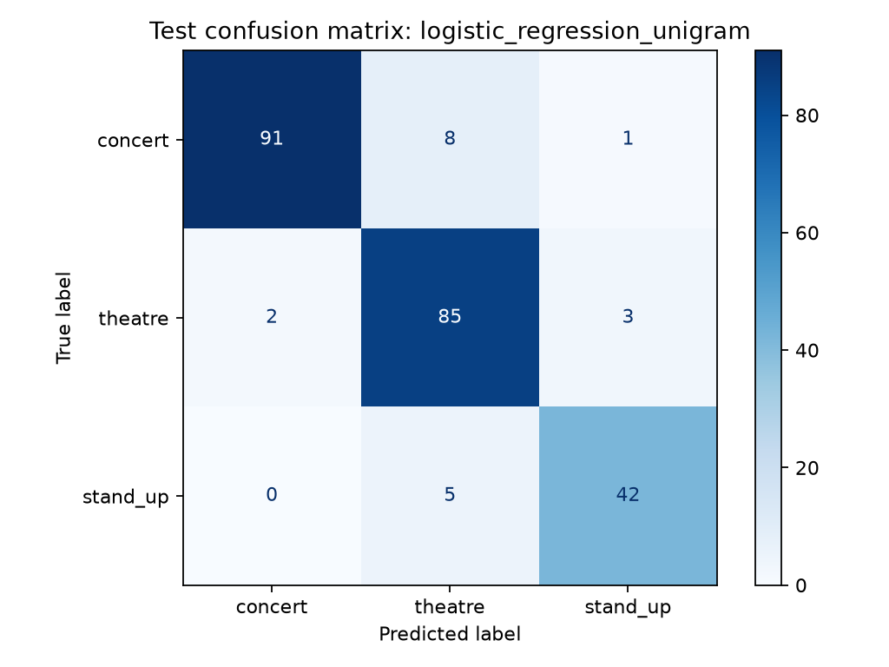

# Frozen experiment result

This result comes from the local run on 2026-10-03. The run used Python 3.13.3 and scikit-learn 1.9.1. The seed is 42. It made no paid API calls.

## Dataset

The importer read 4,076 session records. It produced 1,182 distinct text examples in 965 event families. Labels come from existing collector categories. They are not independent human labels.

| Category | Examples |
|---|---:|
| concert | 499 |
| stand_up | 232 |
| theatre | 451 |

The importer excluded 248 records in conflicting families, 2,223 repeated session records, and 423 short-text records. The groups use conservative exact matching. Some unrecognized event aliases can remain.

| Partition | Text examples | Event families |
|---|---:|---:|
| train | 709 | 581 |
| validation | 236 | 192 |
| test | 237 | 192 |

Each family appears in one partition. The vocabulary comes from training data only. Validation macro F1 selected the model before test evaluation. The saved model keeps its original training fit.

## Model comparison

| Method | Validation macro F1 | Test macro F1 | Test accuracy |
|---|---:|---:|---:|
| Majority-class baseline | 0.1984 | 0.1978 | 42.19% |
| Naive Bayes, words and word pairs | 0.8756 | 0.9060 | 91.14% |
| Logistic Regression, words (selected) | 0.9045 | 0.9168 | 91.98% |
| Logistic Regression, words and word pairs | 0.9032 | 0.9163 | 91.98% |
| Linear SVM, words and word pairs | 0.8918 | 0.9242 | 92.41% |

Logistic Regression with individual words won validation selection. SVM has a slightly higher test score. We did not use the test score to change the selected model. Word pairs did not improve Logistic Regression on this split.

Macro F1 gives equal weight to the categories. These scores measure agreement with collector labels in one fixed split. They do not prove performance on user requests, future provider text, or independently reviewed labels.

## Selected model by category

| Category | Precision | Recall | F1 | Test examples |
|---|---:|---:|---:|---:|
| concert | 0.9785 | 0.9100 | 0.9430 | 100 |
| theatre | 0.8673 | 0.9444 | 0.9043 | 90 |
| stand_up | 0.9130 | 0.8936 | 0.9032 | 47 |

## Error review

The selected model made 19 errors in 237 test examples. The review found two main patterns. Many examples contain only a short title. Comedy and mixed performance descriptions overlap with the theatre category. At least one example has a theatre label while its text describes stand-up. That suggests a source-label error. We did not change labels after seeing test results.

The next label review must create a new dataset version. Review both correct and incorrect predictions. Keep this frozen result as the record of the first experiment.

## Evidence and limits

[Aggregate metrics](evidence/metrics.json) preserve dataset and code hashes, split counts, class metrics, package versions, and local timing. `reports/split.json` preserves the local split IDs. `reports/errors.csv` preserves the local error IDs. Git excludes the corpus, model, and local reports.

Dataset SHA-256: `82fa2017983059b0e84ea656095876a0e43c556feada27b8fd20c7e3caf602c5`.

Snapshot SHA-256: `d1451d486c09e95eeb623f600f0bc6acdb9798df2c9562501e95fb3c2d006a12`.

The baseline is an internal reference. Confirm whether the course also requires an external benchmark. Data reuse permission remains unconfirmed. The repository does not include provider text. The three authored demo samples produced their expected categories. An empty demo input returned HTTP 400. These sample checks are demonstration checks, not a test-set metric.
